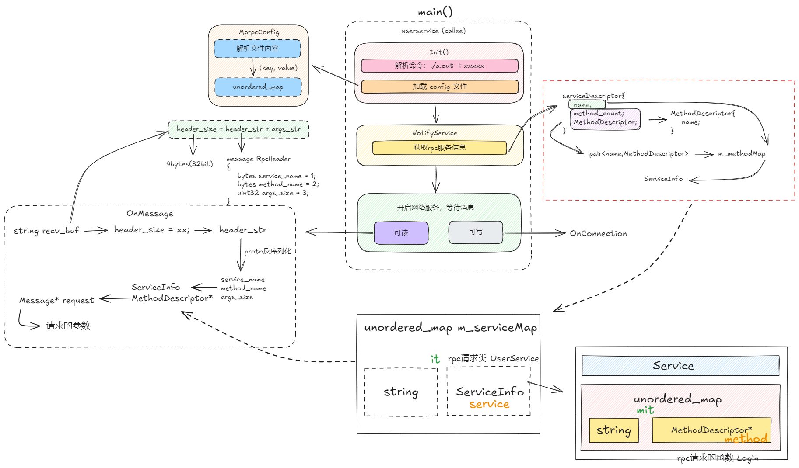

## 重要的版本更新
66539b533914b460d8282cffc404be0f784e00cc 
- ? refactor: 完善加载config配置文件功能

8fe0b73e6cc82318450dc9a952f7fefafc3b3912
- ? feat(RpcProvider): 新增Rpc网络服务、Rpc发布服务方法

## 参考资料
[全图文分析：如何利用Google的protobuf，来思考、设计、实现自己的RPC框架](https://blog.csdn.net/qingzhuyuxian/article/details/118751117)

## 架构图

